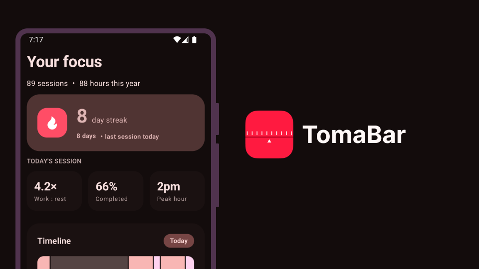
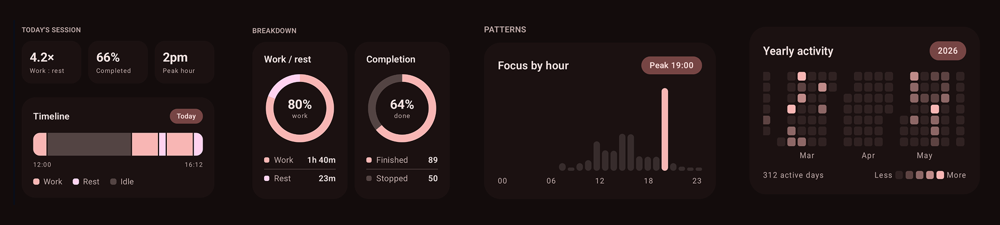

# TomaBar

TomaBar is a little Android app companion for the awesome [TomatoBar](https://github.com/ivoronin/TomatoBar) Pomodoro productivity tool for MacOS.



> #### Why an Android and not an iOS app?
> Well, I still use an Android and I learned a bit of Android development, can't let that go to waste now can I? :P

## Installation

Download the latest release over at the "releases" sidebar tab, or click [here]().

## Self-Hosting

> [!IMPORTANT]  
> The app assumes that you already have TomatoBar installed and setup. It also assumes that you have Docker installed and the self-hosted API is accessible via public internet.

For the best results, I recommend you install [Docker](https://docs.docker.com/engine/install/) if you haven't already.

See [here](./api/README.md) for more information regarding server setup.

### How do I get my IP address?

On the computer where TomatoBar is installed, use the following command:

```bash
ipconfig getifaddr en0
```

Afterwards, use this address in the application.

## FAQ

- **Will there be an iOS version:** No, and it's unlikely there will ever be, contributions are welcome though.

- **I can't connect to my computer:** This might be a firewall issue, otherwise please make sure you've entered the correct IP address and that the server is running.

- **How can I contribute?** I'm generally not accepting requests for new features, however if you'd like to extend the app and have the skills to do so, feel free to fork the repository.

## Credits

The app logo, design, and code were all written by me. Original inspiration for the name came from Tomato Bar.
